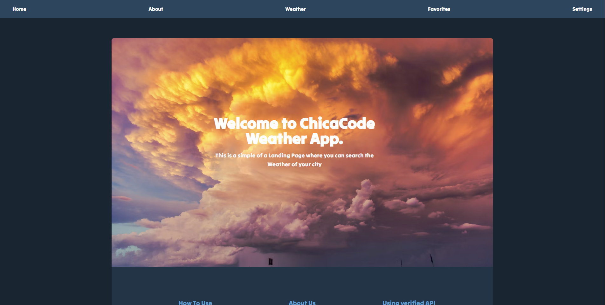
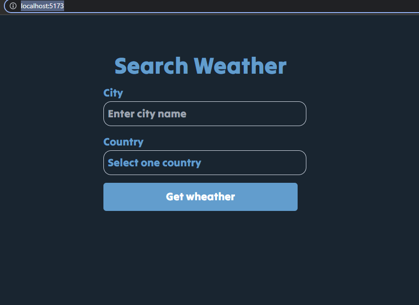
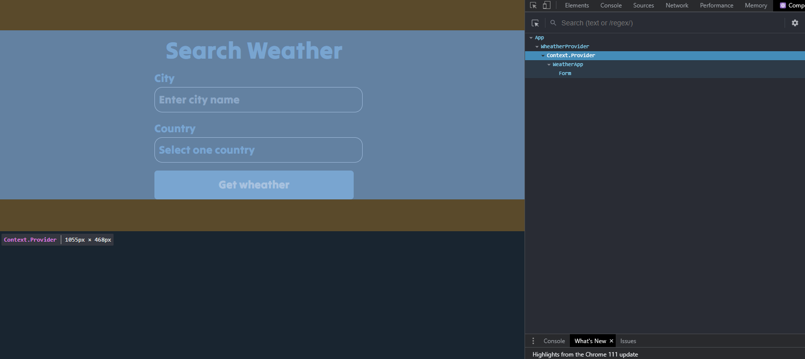
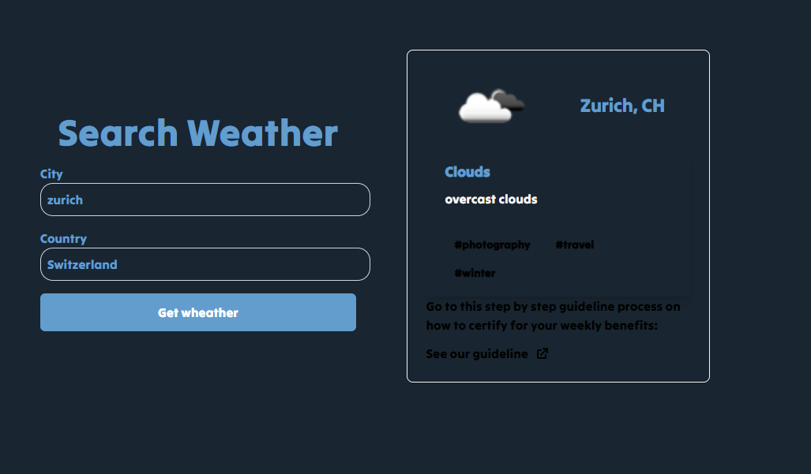
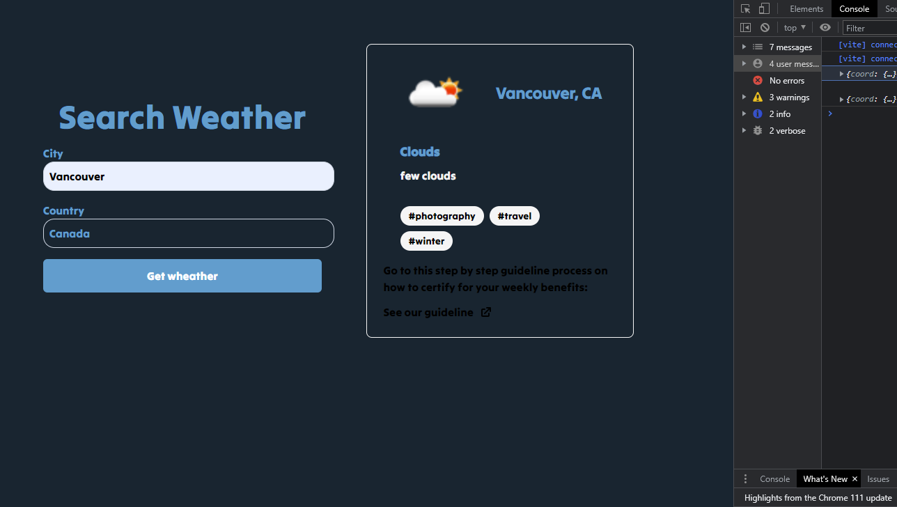
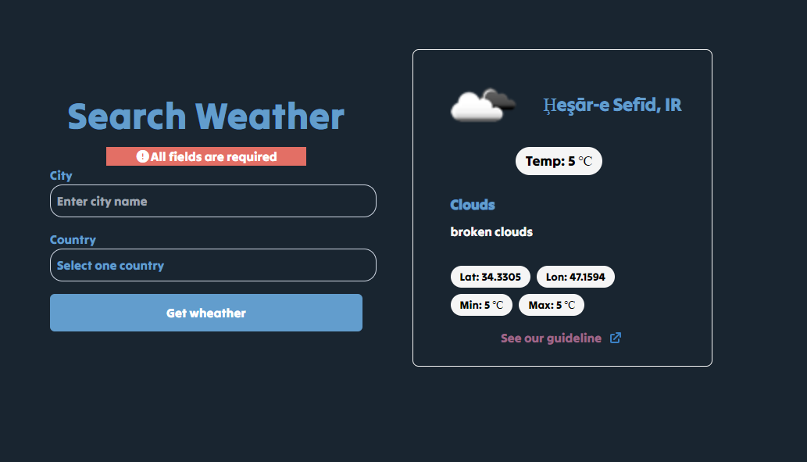
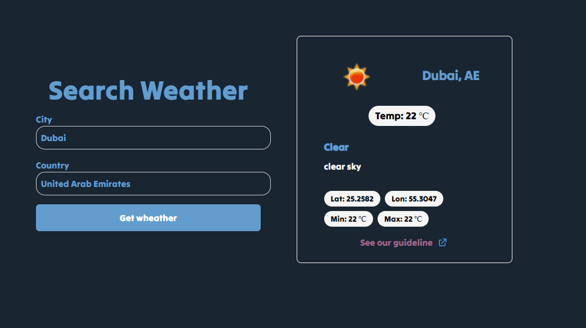

## ReactJs + Vite Weather app project

## Objective: Create an application with React that utilizes data fetching from an API of your choice. You may use any of these API from this list:
- https://home.openweathermap.org/
- https://github.com/public-apis/public-apis
- https://apilist.fun/
- https://rapidapi.com/
- https://apipheny.io/free-api/

## Project Requirements: 
1. Use a CSS Library
Material UI/ Reactstrap / Styled-components / SASS / CSS Module / Regular CSS / Any CSS Libraries
- I'm using Tailwind
2. React Features:
- Functional Components

## Using Vite building
Vite uses the native ES modules feature in the browser to handle imports, while webpack and Parcel use a more traditional approach of bundling all the files together. Thisallows for faster development builds and hot module replacement with Vite
source - medium by Erbil Nas

● Hooks
Class Components
● Lifecycle methods
React Router (optional if your app is Single Page)

## App evolution

## References
- https://snippetsdb.com/convert-kelvin-to-celsius-in-javascript/
- https://home.openweathermap.org/
## Responsiveness
Website should work on both web and smartphone sizes

## Developed by: Geri